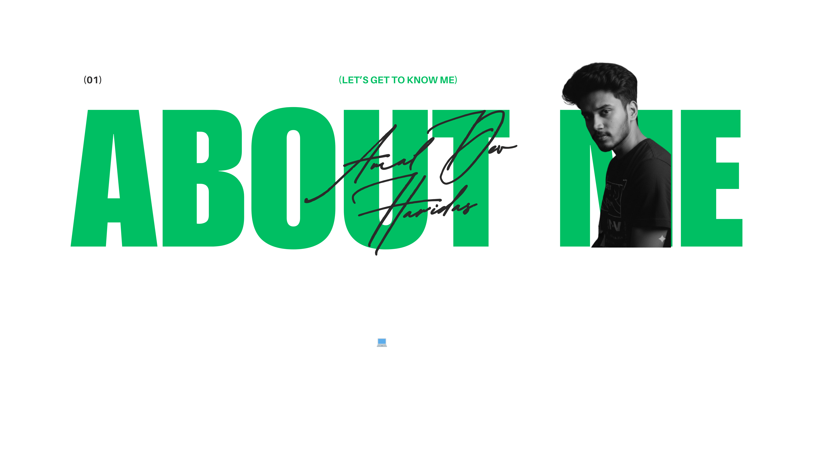
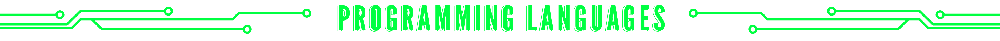
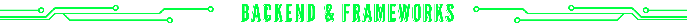
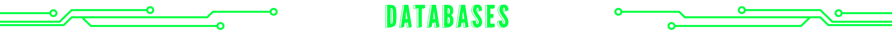

<!-- ████████████████████████████████████████████████████ -->
<!--         AMALDEV M — CYBERPUNK GITHUB PROFILE        -->
<!-- ████████████████████████████████████████████████████ -->

  

<!-- ══════════════════ GLOWING DIVIDER ══════════════════ -->

  

<!-- ══════════════════ SNAKE ANIMATION ══════════════════ -->

  <picture>
    <source media="(prefers-color-scheme: dark)" srcset="https://raw.githubusercontent.com/AmaldevM/AmaldevM/output/github-snake-dark.svg" />
    <source media="(prefers-color-scheme: light)" srcset="https://raw.githubusercontent.com/AmaldevM/AmaldevM/output/github-snake.svg" />
    
  </picture>

<!-- ══════════════════ ABOUT ME ══════════════════════════ -->

  

  

<!-- ══════════════ NEON HEADER: STATS ═════════════════ -->

  

  
  

<!-- ══════════════ STREAK STATS ══════════════════════════ -->

  

<!-- ══════════════ ACTIVITY GRAPH ════════════════════════ -->

  

<!-- ══════ CUSTOM CYBERPUNK STATS CARD ══════════════════ -->

  

<!-- ══════ NEON HEADER: TROPHIES ══════════════════════════ -->

  

  

  

<!-- ══════ NEON HEADER: GAMIFIED CODER CARD ══════════════ -->

  

  

  
  
  

<!-- ══════ NEON HEADER: SKILL POWER LEVELS ═══════════════ -->

  

  
  
  

  
  
  

<!-- ══════ LANGUAGES SECTION ══════════════════════════════ -->

  

  

 

  

  

 

  

  

 

  

  

 

  

  

<!-- ══════ NEON HEADER: PROJECTS ═════════════════════════ -->

  

  
  &nbsp;
  

<!-- ══════ RANDOM DEV QUOTE ══════════════════════════════ -->

  

<!-- ══════ PROFILE VIEWS + CONNECT ═══════════════════════ -->

  

  &nbsp;&nbsp;
  &nbsp;&nbsp;
  &nbsp;&nbsp;
  &nbsp;&nbsp;
  &nbsp;&nbsp;
  

 

<!-- ══════ WAVING FOOTER ══════════════════════════════════ -->

  

